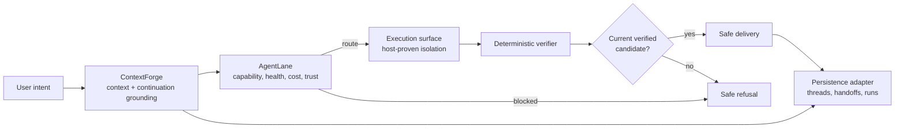

# ZivLabs

ZivLabs is a trust-aware multi-AI workspace architecture. It turns a bounded
user intent into a grounded task, routes it to a capable execution surface,
requires independently declared verification, and allows delivery only when
the evidence is current.

It is a runnable, dependency-free public V1: the modules are real and the
demos exercise the same orchestration contracts used by the tests. The demos
are deterministic fixtures. They do **not** contact providers, run a shell, or
modify a project.

## Why this exists

Multi-model workflows fail when provider choice, context, execution trust, and
delivery are separate informal decisions. ZivLabs keeps those decisions
inspectable:

- **AgentLane** chooses the lowest-cost healthy lane that actually satisfies
  the task capabilities and write-trust requirement.
- **ContextForge** compiles a bounded, provenance-preserving context pack and
  grounds continuation against the current project revision.
- **Execution contracts** bind write permission to an execution surface and a
  passing host confinement receipt, rather than a provider label.
- **Verification and delivery gates** reject model prose as proof and fail
  closed for stale handoffs, route denial, or failed checks.

## Architecture



The public surface is split so hosts can replace adapters without teaching the
orchestrator provider-specific behavior:

| Area | Public module | Responsibility |
| --- | --- | --- |
| Shared contracts | `packages/shared` | small immutable assertions and cloning helpers |
| AgentLane | `packages/agentlane` | task signatures, health/capability/trust routing, escalation admission |
| ContextForge | `packages/contextforge` | bounded context, provenance, redaction, grounded continuation, handoffs |
| Providers | `packages/providers` | normalized availability state, including quota exhaustion |
| Execution | `packages/execution` | host execution-surface contract and fail-closed demo worker |
| Verification | `packages/verification` | candidate plus declared-check receipt evaluation |
| Delivery | `packages/delivery` | current-handoff and verification gate |
| Persistence | `packages/persistence` | swappable in-memory run/thread/handoff/provider-state adapter |
| Workspace shell | `apps/desktop` | host-neutral escaped renderer and persistence bridge |
| Orchestration | `packages/zivlabs` | end-to-end deterministic mission flow |

Read the subsystem guides: [AgentLane](docs/AGENTLANE.md),
[ContextForge](docs/CONTEXTFORGE.md), [execution model](docs/EXECUTION_MODEL.md),
[providers](docs/PROVIDERS.md), [architecture](docs/ARCHITECTURE.md), and
[security boundaries](docs/SECURITY.md).

## Quick start

```sh
git clone https://github.com/ZivK00/zivlabs.git
cd zivlabs
npm install
npm run typecheck
npm test
npm run build
```

Run the fixture demonstrations:

```sh
npm run demo:multi-ai   # planning role + trusted implementation route + delivery
npm run demo:continue   # grounded continuation against a revision
npm run demo:trust      # quota outage blocks the only qualified writer
npm run desktop:demo    # safe HTML shell rendering of the same mission
```

## Trust boundary

This repository does not claim that a provider is safe to write by name alone.
A production host must provide a version-bound, passing confinement receipt for
the exact execution surface. A direct external-path escape and a symlink escape
must both be refused and leave their targets unchanged. If that proof is
missing or fails, AgentLane must leave the worker ineligible for write work.

The included `wsl2` surface is a **fixture label**, not a claim that a local
machine has achieved confinement. See [execution model](docs/EXECUTION_MODEL.md)
for host responsibilities.

## Scope and non-goals

- No model credentials, authentication, shell execution, filesystem mutation,
  provider SDK, or private project state is present.
- The desktop directory is a host-neutral shell foundation, not a packaged
  Electron release.
- `MemoryRunStore` is a demo persistence adapter. A production adapter must
  make its own encryption, retention, migrations, and access-control decisions.
- The public API is V1 and may change before a stable major version.

## Development

`npm test` runs unit and integration tests across the whole public flow.
`npm run typecheck` parses every source module with Node. The GitHub Actions
workflow runs install, tests, and build on each push and pull request.

## License

[MIT](LICENSE)
