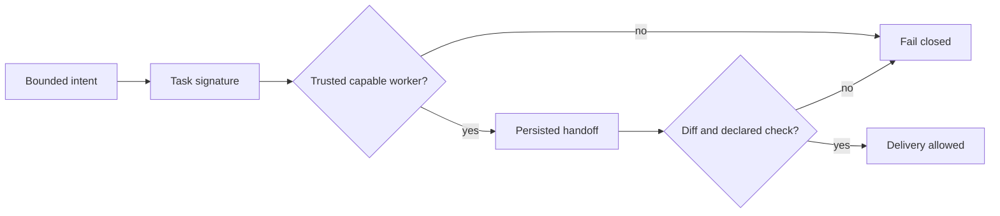

# ZivLabs

ZivLabs is a small, dependency-free reference core for routing bounded AI work
without treating a model response as proof of a safe change.

It focuses on four decisions that remain useful as providers change:

- select only a capable, trusted execution surface;
- preserve a compact handoff between planning and implementation;
- require deterministic evidence for a proposed change;
- permit delivery only after the required evidence is complete.

It is intentionally a runnable, local demo. It does not call a model, execute
shell commands, or modify a project.

## Quick start

```sh
git clone https://github.com/ZivK00/zivlabs.git
cd zivlabs
npm install
npm test
npm run build
npm run demo
```

The demo uses sample data and prints the route, handoff, verification receipt,
and delivery decision. Its output is not a claim that any provider ran.

## Flow



## Core concepts

| Module | Responsibility |
| --- | --- |
| `task-signature` | expresses required capabilities for a bounded task |
| `trust-router` | chooses an eligible worker or returns a denial |
| `continuation` | accepts only fresh, source-grounded handoffs |
| `verification` | validates deterministic proof, not prose |
| `delivery` | gates application on verified evidence |

See [architecture](docs/ARCHITECTURE.md) and [security boundaries](docs/SECURITY.md)
for the intentionally narrow contract.

## Status and license

This is an early public core, not a hosted service or provider SDK. The public
API may evolve before a stable release. License selection is deliberately
pending; see [LICENSE_DECISION.md](LICENSE_DECISION.md). Until then, no license
grant is implied.
