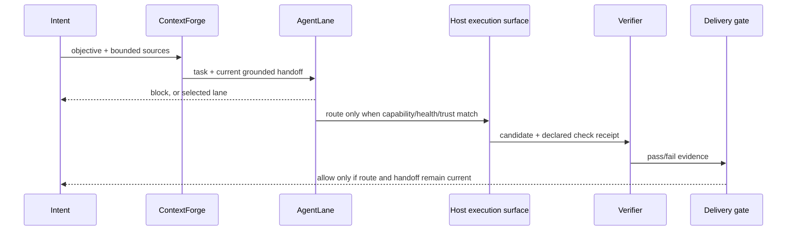

# Architecture

ZivLabs has one direction of authority:

`packages/zivlabs/src/orchestrator.mjs` composes the public contracts. It does
not own a provider SDK, a database driver, a sandbox, or delivery side effects.
Those are host adapters. Keeping them outside the core makes the decision
boundary testable and prevents a provider-specific special case from spreading
through the workflow.

## State ownership

| State | Owner | Public V1 implementation |
| --- | --- | --- |
| task signature and route | AgentLane | immutable return values |
| bounded context and handoff | ContextForge | immutable packs and revision comparison |
| worker confinement | host execution adapter | explicit surface evidence input |
| candidate verification | verifier adapter | changed-file list plus declared check |
| delivery decision | delivery gate | pure, fail-closed result |
| runs, threads, handoffs, provider health | persistence adapter | `MemoryRunStore` fixture |

This separation is deliberate: provider response text cannot make itself a
delivery receipt, and a successful route cannot bypass verification.

## Desktop shell boundary

`apps/desktop/renderer/shell.mjs` is intentionally host-neutral HTML rendering.
An Electron host can mount it behind a restrictive preload bridge; a web host
can use it as a view model. It escapes dynamic text and receives a completed
mission state. It does not obtain Node, shell, filesystem, credential, or
provider access.
