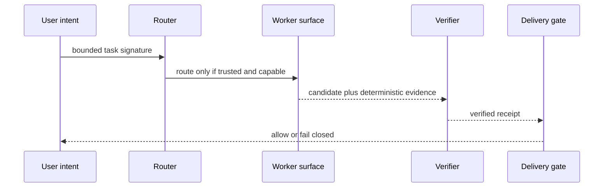

# Architecture

The core is deliberately split into pure functions. A host application owns
provider adapters, persistence, process isolation, and user confirmation; this
package makes their safety decisions explicit and testable.

The route decision is not a delivery decision. A route merely identifies an
eligible surface. Delivery needs a current handoff, a non-empty change receipt,
and a passing declared check.
